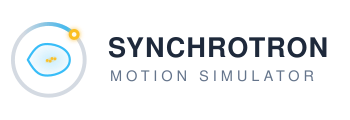

<p align="center">
  
</p>

A Python-based simulator for synchrotron longitudinal beam dynamics during booster ramping cycles. It models RF capture, phase-space evolution, and particle tracking for both proton and electron beams.

**Author:** Cheng-Chin (C.C.) Chiang (2014)

## Overview

This tool simulates the longitudinal motion of charged particles in a synchrotron booster ring. It supports:

- Plotting energy, RF voltage, and other ramping parameters over a full cycle
- Computing and visualizing the RF bucket (separatrix) envelope in phase space
- Single-particle tracking through the ramping cycle
- Multi-particle tracking with capture efficiency calculation
- Animated visualizations of phase-space evolution (exported as `.mp4`)

The physics and mathematical formulations are documented in [`Documentation/MarkCCChiang-note.pdf`](Documentation/MarkCCChiang-note.pdf).

## Requirements

- **Python** >= 3.12
- **NumPy**
- **Matplotlib** >= 1.2
- **FFmpeg** (for generating animation videos)

## Setup

This is a flat collection of scripts with no package metadata, so a plain virtual
environment is all that is needed. Using [uv](https://docs.astral.sh/uv/):

```bash
uv venv --python 3.12             # creates .venv/
uv pip install numpy matplotlib
```

Then either activate the environment:

```bash
source .venv/bin/activate         # Windows: .venv\Scripts\activate
```

or skip activation and call the interpreter directly, e.g.
`.venv/bin/python track-electron.py`.

FFmpeg is not a Python package and must be installed separately — `brew install
ffmpeg` on macOS, `apt install ffmpeg` on Debian/Ubuntu. It is only required by the
`*-animation-*.py` scripts.

## Project Structure

| File | Description |
|------|-------------|
| `Input.py` | User-configurable parameters (beam energy, RF settings, etc.) |
| `BasicFunc.py` | Core physics functions (energy, RF, tracking iterations) |
| `plot-{proton,electron}.py` | Plot ramping parameters (energy, voltage, frequency, etc.) |
| `envelope-{proton,electron}.py` | Compute the phase-space envelope at a given time |
| `envelope-animation-{proton,electron}.py` | Animate the envelope over the ramping cycle |
| `track-{proton,electron}.py` | Single-particle phase-space tracking |
| `track-animation{1,2,3}-{proton,electron}.py` | Animated multi-particle tracking |
| `track-multiparticle-{proton,electron}.py` | Multi-particle tracking with capture efficiency output |
| `plot-eff-vs-time-{proton,electron}.py` | Plot capture efficiency vs. time |
| `plot-phase-space-{proton,electron}.py` | Plot phase-space snapshots |
| `Input.py.example-proton` | Example input parameters for proton simulation |
| `Input.py.example-electron` | Example input parameters for electron simulation |

## Usage

### 1. Configure input parameters

Copy one of the example configuration files to `Input.py`:

```bash
# For proton simulation
cp Input.py.example-proton Input.py

# For electron simulation
cp Input.py.example-electron Input.py
```

Edit `Input.py` to adjust beam energy, RF voltage, harmonic number, and other parameters as needed.

### 2. Run the simulation scripts

Run these from the repository root. The explicit interpreter path needs no
activation; if you activated the environment instead (see [Setup](#setup)), plain
`python` works in its place.

**Proton simulation:**

```bash
.venv/bin/python plot-proton.py                 # Plot ramping parameters
.venv/bin/python envelope-proton.py             # Phase-space envelope
.venv/bin/python envelope-animation-proton.py   # Envelope animation  -> envelope-animation-proton.mp4
.venv/bin/python track-proton.py                # Single-particle tracking
.venv/bin/python track-animation1-proton.py     # Tracking animation 1 -> track-animation1-proton.mp4
.venv/bin/python track-animation2-proton.py     # Tracking animation 2 -> track-animation2-proton.mp4
.venv/bin/python track-animation3-proton.py     # Tracking animation 3 -> track-animation3-proton.mp4
.venv/bin/python track-multiparticle-proton.py  # Multi-particle stats  -> eff-proton.dat
.venv/bin/python plot-eff-vs-time-proton.py     # Plot efficiency data
.venv/bin/python plot-phase-space-proton.py     # Phase-space snapshot
```

**Electron simulation:**

```bash
.venv/bin/python plot-electron.py                 # Plot ramping parameters
.venv/bin/python envelope-electron.py             # Phase-space envelope
.venv/bin/python envelope-animation-electron.py   # Envelope animation  -> envelope-animation-electron.mp4
.venv/bin/python track-electron.py                # Single-particle tracking
.venv/bin/python track-animation1-electron.py     # Tracking animation 1 -> track-animation1-electron.mp4
.venv/bin/python track-animation2-electron.py     # Tracking animation 2 -> track-animation2-electron.mp4
.venv/bin/python track-animation3-electron.py     # Tracking animation 3 -> track-animation3-electron.mp4
.venv/bin/python track-multiparticle-electron.py  # Multi-particle stats  -> eff-electron.dat
.venv/bin/python plot-eff-vs-time-electron.py     # Plot efficiency data
.venv/bin/python plot-phase-space-electron.py     # Phase-space snapshot
```

## Documentation

Full documentation (theory, optimization results, code reference) is available
as a Sphinx project under the `docs/` directory. To build it:

```bash
uv pip install sphinx
cd docs
make html
```

The generated HTML will be at `docs/_build/html/index.html`.

## License

ISC License. See [LICENSE.md](LICENSE.md) for details.
